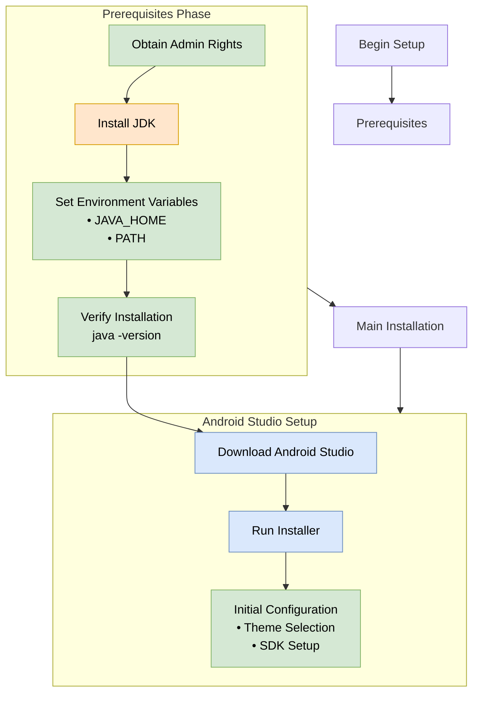

# Introduction 
TODO: Give a short introduction of your project. Let this section explain the objectives or the motivation behind this project. 

# Getting Started

### System Requirements

| Component | Minimum Requirement | Recommended |
| --- | --- | --- |
| Operating System | Windows 10 (64-bit) | Windows 10 Enterprise (64-bit) |
| RAM | 4 GB | 8 GB + 1 GB for Emulator |
| Disk Space | 2 GB | 4 GB |
| Screen Resolution | 1280 x 800 | 1920 x 1080 |

### Setup Process Overview



### Step-by-Step Setup Instructions

#### Obtain Admin Rights

To obtain Administrative Privileges to your PC, please refer to [Request Admin Rights on Laptop](https://dev.azure.com/SecuritasTechnologyCorp/SecureStat%20HQ/_wiki/wikis/SecureStat-HQ.wiki/88/Request-Admin-Rights-on-Laptop)


#### Install Java Development Kit (JDK)

- Visit Oracle's official JDK archive download page, [jdk17 archive downloads](https://www.oracle.com/java/technologies/javase/jdk17-0-13-later-archive-downloads.html)
- Select the latest version of the JDK17 Windows x64 installer
- Run the downloaded executable
- Accept license agreement
- Choose installation location (default recommended)
- Wait for installation completion

##### Configure Environment Variables

- Search for "Environment Variables" in Start menu
- Click "Edit the system environment variables"
- Under System Variables, add:
  - JAVA_HOME: Path to JDK installation directory
  - PATH: Add path to JDK bin folder

##### Verify Java Installation

```bash
    java -version
```

This command should display the installed Java version.

Install Android Studio

- Visit developer.android.com/studio, [Download Android Studio & App Tools - Android Developers](https://developer.android.com/studio)
- Click "Download Android Studio"
- Run the downloaded executable
- Follow installation wizard prompts
- Choose installation location (default recommended)

Initial Configuration- Launch Android Studio
- Choose "Standard" setup option
- Select preferred theme (Light/Dark)
- Allow SDK component downloads
- Wait for initial setup completion

### Additional Configuration Steps

#### Set Up Virtual Device

- Open AVD Manager
- Create New Virtual Device
- Select device definition (e.g., Pixel series)
- Choose system image
- Configure RAM settings (minimum 4GB recommended)

#### Enable Hardware Acceleration

- Intel HAXM for Intel processors
- Windows Hypervisor Platform for AMD/other processors

Your PC is now properly configured for Android development. For additional info, aka next steps, checkout the Mobile Release guide wiki --

[Mobile App Release Guides Wiki](https://dev.azure.com/SecuritasTechnologyCorp/SecureStat%20HQ/_wiki/wikis/SecureStat-HQ.wiki/309/Mobile-App-Release-Guides)


# Build and Test
TODO: Describe and show how to build your code and run the tests. 

# Contribute
TODO: Explain how other users and developers can contribute to make your code better. 

If you want to learn more about creating good readme files then refer the following [guidelines](https://www.visualstudio.com/en-us/docs/git/create-a-readme). You can also seek inspiration from the below readme files:
- [ASP.NET Core](https://github.com/aspnet/Home)
- [Visual Studio Code](https://github.com/Microsoft/vscode)
- [Chakra Core](https://github.com/Microsoft/ChakraCore)