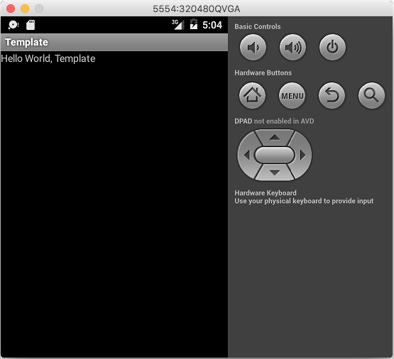

fiddle-0093-InitAndroidProject
======

### Title

Init Android Project

### Creation Date

09-30-16

### Location

Chicago, IL

### Issue

[Issue 77](https://github.com/bradyhouse/house/issues/77)

### Description

There is one remaining collection hole:  _android_.  Having filled the _java_ hole, I need to use a similar approach for android.  As a starting point, a bash POC exploring how to initiate an android project from the command line is needed.

### Pre-Requisites

In order to run this POC, android and gradle should be installed on your machine.  The version details are then 
configured via the [.androidrc](scripts/bin/android/.androidrc):

    #!/usr/bin/env bash
    # ---------------------------------------------------------------------------------------------------|
    #  Repo                    : https://github.com/bradyhouse/house_____________________________________|
    #  Specification           : N/A_____________________________________________________________________|
    #  Specification Path      : N/A_____________________________________________________________________|
    #  Author                  : brady house_____________________________________________________________|
    #  Create date             : 05/02/2016______________________________________________________________|
    #  Description             : GLOBAL VARIABLE CONFIG USED BY ANDROID CREATE/START SCRIPTS.____________|
    # ---------------------------------------------------------------------------------------------------|
    #  Revision History::::::::::::::::::::::::::::::::::::::::::::::::::::::::::::::::::::::::::::::::::|
    # ---------------------------------------------------------------------------------------------------|
    # Baseline Ver - CHANGELOG @ 201610010420
    # ---------------------------------------------------------------------------------------------------|
    
    export __CREATE_PROJECT_TARGET__="5";
    export __CREATE_PROJECT_PACKAGE__="fiddle.android";
    export __CREATE_ANDROID_GRADLE_VERSION__="2.1.2";
    export __CREATE_ANDROID_VERSION__="24.0.2";
    export __CREATE_GOOGLE_API_VERSION__="19";
    export __CREATE_GRADLE_VERSION__="2.10";
    
    export __START_ANDROID_EMULATOR_PROFILE__=320480QVGA;
    export __START_ANDROID_EMULATOR_EXE__="/Users/bradyhouse/bin/android-sdk-macosx/tools/emulator";

### Use Case

#### To Run ...

To create a new Android project, from the root directory, execute the `run.sh` script:

    ./run.sh

If everything is working properly, it should generate the following output:

    RUN.SH
    Bash version 3.2.57(1)-release...
    ┌──FIDDLE-ANDROID.SH
    ├────APP NAME:
    "console"
    ├────ANDROIDCREATE
    ├────INITFIDDLEDIRECTORY
    ├────INITFIDDLECONFIGFILE
    Password:
    ├────INITANDROIDPROJECT
    Created project directory: console
    Created directory /Users/bradyhouse/github/house/fiddles/bash/fiddle-0093-InitAndroidProject/fiddles/android/fiddle-0001-Console/console/src/main/java
    Created directory /Users/bradyhouse/github/house/fiddles/bash/fiddle-0093-InitAndroidProject/fiddles/android/fiddle-0001-Console/console/src/main/java/fiddle/android
    Added file console/src/main/java/fiddle/android/Console.java
    Created directory /Users/bradyhouse/github/house/fiddles/bash/fiddle-0093-InitAndroidProject/fiddles/android/fiddle-0001-Console/console/src/androidTest/java
    Created directory /Users/bradyhouse/github/house/fiddles/bash/fiddle-0093-InitAndroidProject/fiddles/android/fiddle-0001-Console/console/src/androidTest/java/fiddle/android
    Added file console/src/androidTest/java/fiddle/android/ConsoleTest.java
    Created directory /Users/bradyhouse/github/house/fiddles/bash/fiddle-0093-InitAndroidProject/fiddles/android/fiddle-0001-Console/console/src/main/res
    Created directory /Users/bradyhouse/github/house/fiddles/bash/fiddle-0093-InitAndroidProject/fiddles/android/fiddle-0001-Console/console/src/main/res/values
    Added file console/src/main/res/values/strings.xml
    Created directory /Users/bradyhouse/github/house/fiddles/bash/fiddle-0093-InitAndroidProject/fiddles/android/fiddle-0001-Console/console/src/main/res/layout
    Added file console/src/main/res/layout/main.xml
    Created directory /Users/bradyhouse/github/house/fiddles/bash/fiddle-0093-InitAndroidProject/fiddles/android/fiddle-0001-Console/console/src/main/res/drawable-xhdpi
    Created directory /Users/bradyhouse/github/house/fiddles/bash/fiddle-0093-InitAndroidProject/fiddles/android/fiddle-0001-Console/console/src/main/res/drawable-hdpi
    Created directory /Users/bradyhouse/github/house/fiddles/bash/fiddle-0093-InitAndroidProject/fiddles/android/fiddle-0001-Console/console/src/main/res/drawable-mdpi
    Created directory /Users/bradyhouse/github/house/fiddles/bash/fiddle-0093-InitAndroidProject/fiddles/android/fiddle-0001-Console/console/src/main/res/drawable-ldpi
    Added file console/src/main/AndroidManifest.xml
    Added file console/build.gradle
    Created directory /Users/bradyhouse/github/house/fiddles/bash/fiddle-0093-InitAndroidProject/fiddles/android/fiddle-0001-Console/console/gradle/wrapper
    ├────ANDROID PROJECT, "CONSOLE", CREATED
    ├────INITGRADLECONFIG
    ├────GRADLEW CHECK - SUCCESSFUL.
    ├────INITGRADLE
    Observed package id '..;..;..;var;lib;android-sdk;samples;android-19' in inconsistent location '/usr/local/Cellar/android-sdk/24.1.2/samples/android-19' (Expected '/usr/local/Cellar/android-sdk/24.1.2/../../../var/lib/android-sdk/samples/android-19')
    Observed package id '..;..;..;var;lib;android-sdk;samples;android-23' in inconsistent location '/usr/local/Cellar/android-sdk/24.1.2/samples/android-23' (Expected '/usr/local/Cellar/android-sdk/24.1.2/../../../var/lib/android-sdk/samples/android-23')
    Incremental java compilation is an incubating feature.
    :preBuild UP-TO-DATE
    :preDebugBuild UP-TO-DATE
    :checkDebugManifest
    :prepareDebugDependencies
    :compileDebugAidl
    :compileDebugRenderscript
    :generateDebugBuildConfig
    :mergeDebugShaders
    :compileDebugShaders
    :generateDebugAssets
    :mergeDebugAssets
    :generateDebugResValues
    :generateDebugResources
    :mergeDebugResources
    :processDebugManifest
    :processDebugResources
    :generateDebugSources
    :incrementalDebugJavaCompilationSafeguard
    :compileDebugJavaWithJavac
    :compileDebugJavaWithJavac - is not incremental (e.g. outputs have changed, no previous execution, etc.).
    :compileLint
    :preReleaseBuild UP-TO-DATE
    :checkReleaseManifest
    :prepareReleaseDependencies
    :compileReleaseAidl
    :compileReleaseRenderscript
    :generateReleaseBuildConfig
    :mergeReleaseShaders
    :compileReleaseShaders
    :generateReleaseAssets
    :mergeReleaseAssets
    :generateReleaseResValues
    :generateReleaseResources
    :mergeReleaseResources
    :processReleaseManifest
    :processReleaseResources
    :generateReleaseSources
    :incrementalReleaseJavaCompilationSafeguard
    :compileReleaseJavaWithJavac
    :compileReleaseJavaWithJavac - is not incremental (e.g. outputs have changed, no previous execution, etc.).
    :lint
    Ran lint on variant release: 5 issues found
    Ran lint on variant debug: 5 issues found
    Wrote HTML report to file:///Users/bradyhouse/github/house/fiddles/bash/fiddle-0093-InitAndroidProject/fiddles/android/fiddle-0001-Console/console/build/outputs/lint-results-debug.html
    Wrote XML report to file:///Users/bradyhouse/github/house/fiddles/bash/fiddle-0093-InitAndroidProject/fiddles/android/fiddle-0001-Console/console/build/outputs/lint-results-debug.xml
    :incrementalDebugUnitTestJavaCompilationSafeguard UP-TO-DATE
    :preDebugUnitTestBuild UP-TO-DATE
    :prepareDebugUnitTestDependencies
    :compileDebugUnitTestJavaWithJavac UP-TO-DATE
    :processDebugJavaRes UP-TO-DATE
    :processDebugUnitTestJavaRes UP-TO-DATE
    :compileDebugUnitTestSources UP-TO-DATE
    :mockableAndroidJar
    :assembleDebugUnitTest
    :testDebugUnitTest
    :incrementalReleaseUnitTestJavaCompilationSafeguard UP-TO-DATE
    :preReleaseUnitTestBuild UP-TO-DATE
    :prepareReleaseUnitTestDependencies
    :compileReleaseUnitTestJavaWithJavac UP-TO-DATE
    :processReleaseJavaRes UP-TO-DATE
    :processReleaseUnitTestJavaRes UP-TO-DATE
    :compileReleaseUnitTestSources UP-TO-DATE
    :assembleReleaseUnitTest
    :testReleaseUnitTest
    :test
    :check
    
    BUILD SUCCESSFUL
    
    Total time: 12.737 secs
    
    This build could be faster, please consider using the Gradle Daemon: https://docs.gradle.org/2.10/userguide/gradle_daemon.html
    ├────GRADLEW CHECK - SUCCESSFUL.
    ├────"FIDDLE-0001-CONSOLE" CREATED.
    └──FIDDLE-ANDROID.SH
    
    └──RUN.SH

#### To Test ...

This POC includes all of the logic necessary to extend the `fiddle.sh` script with java fiddle support.  To see all of this
functionality in action.  Run the following command:

    ./test.sh
    
If everything is working properly, it should generate the following output:

    ┌──TEST.SH
    ├────TESTUTILCAPITALIZE
    Template
    ├────TESTISANDROIDINSTALLED
    ├────TESTANDROIDCREATE
    ├────ANDROIDCREATE
    ├────INITFIDDLEDIRECTORY
    ├────INITFIDDLECONFIGFILE
    ├────INITANDROIDPROJECT
    Created project directory: template
    Created directory /Users/bradyhouse/github/house/fiddles/bash/fiddle-0093-InitAndroidProject/fiddles/android/fiddle-0000-Template/template/src/main/java
    Created directory /Users/bradyhouse/github/house/fiddles/bash/fiddle-0093-InitAndroidProject/fiddles/android/fiddle-0000-Template/template/src/main/java/fiddle/android
    Added file template/src/main/java/fiddle/android/Template.java
    Created directory /Users/bradyhouse/github/house/fiddles/bash/fiddle-0093-InitAndroidProject/fiddles/android/fiddle-0000-Template/template/src/androidTest/java
    Created directory /Users/bradyhouse/github/house/fiddles/bash/fiddle-0093-InitAndroidProject/fiddles/android/fiddle-0000-Template/template/src/androidTest/java/fiddle/android
    Added file template/src/androidTest/java/fiddle/android/TemplateTest.java
    Created directory /Users/bradyhouse/github/house/fiddles/bash/fiddle-0093-InitAndroidProject/fiddles/android/fiddle-0000-Template/template/src/main/res
    Created directory /Users/bradyhouse/github/house/fiddles/bash/fiddle-0093-InitAndroidProject/fiddles/android/fiddle-0000-Template/template/src/main/res/values
    Added file template/src/main/res/values/strings.xml
    Created directory /Users/bradyhouse/github/house/fiddles/bash/fiddle-0093-InitAndroidProject/fiddles/android/fiddle-0000-Template/template/src/main/res/layout
    Added file template/src/main/res/layout/main.xml
    Created directory /Users/bradyhouse/github/house/fiddles/bash/fiddle-0093-InitAndroidProject/fiddles/android/fiddle-0000-Template/template/src/main/res/drawable-xhdpi
    Created directory /Users/bradyhouse/github/house/fiddles/bash/fiddle-0093-InitAndroidProject/fiddles/android/fiddle-0000-Template/template/src/main/res/drawable-hdpi
    Created directory /Users/bradyhouse/github/house/fiddles/bash/fiddle-0093-InitAndroidProject/fiddles/android/fiddle-0000-Template/template/src/main/res/drawable-mdpi
    Created directory /Users/bradyhouse/github/house/fiddles/bash/fiddle-0093-InitAndroidProject/fiddles/android/fiddle-0000-Template/template/src/main/res/drawable-ldpi
    Added file template/src/main/AndroidManifest.xml
    Added file template/build.gradle
    Created directory /Users/bradyhouse/github/house/fiddles/bash/fiddle-0093-InitAndroidProject/fiddles/android/fiddle-0000-Template/template/gradle/wrapper
    ├────ANDROID PROJECT, "TEMPLATE", CREATED
    ├────INITGRADLECONFIG
    ├────GRADLEW CHECK - SUCCESSFUL.
    ├────INITGRADLE
    Observed package id '..;..;..;var;lib;android-sdk;samples;android-19' in inconsistent location '/usr/local/Cellar/android-sdk/24.1.2/samples/android-19' (Expected '/usr/local/Cellar/android-sdk/24.1.2/../../../var/lib/android-sdk/samples/android-19')
    Observed package id '..;..;..;var;lib;android-sdk;samples;android-23' in inconsistent location '/usr/local/Cellar/android-sdk/24.1.2/samples/android-23' (Expected '/usr/local/Cellar/android-sdk/24.1.2/../../../var/lib/android-sdk/samples/android-23')
    Incremental java compilation is an incubating feature.
    :preBuild UP-TO-DATE
    :preDebugBuild UP-TO-DATE
    :checkDebugManifest
    :prepareDebugDependencies
    :compileDebugAidl
    :compileDebugRenderscript
    :generateDebugBuildConfig
    :mergeDebugShaders
    :compileDebugShaders
    :generateDebugAssets
    :mergeDebugAssets
    :generateDebugResValues
    :generateDebugResources
    :mergeDebugResources
    :processDebugManifest
    :processDebugResources
    :generateDebugSources
    :incrementalDebugJavaCompilationSafeguard
    :compileDebugJavaWithJavac
    :compileDebugJavaWithJavac - is not incremental (e.g. outputs have changed, no previous execution, etc.).
    :compileLint
    :preReleaseBuild UP-TO-DATE
    :checkReleaseManifest
    :prepareReleaseDependencies
    :compileReleaseAidl
    :compileReleaseRenderscript
    :generateReleaseBuildConfig
    :mergeReleaseShaders
    :compileReleaseShaders
    :generateReleaseAssets
    :mergeReleaseAssets
    :generateReleaseResValues
    :generateReleaseResources
    :mergeReleaseResources
    :processReleaseManifest
    :processReleaseResources
    :generateReleaseSources
    :incrementalReleaseJavaCompilationSafeguard
    :compileReleaseJavaWithJavac
    :compileReleaseJavaWithJavac - is not incremental (e.g. outputs have changed, no previous execution, etc.).
    :lint
    Ran lint on variant debug: 5 issues found
    Ran lint on variant release: 5 issues found
    Wrote HTML report to file:///Users/bradyhouse/github/house/fiddles/bash/fiddle-0093-InitAndroidProject/fiddles/android/fiddle-0000-Template/template/build/outputs/lint-results-debug.html
    Wrote XML report to file:///Users/bradyhouse/github/house/fiddles/bash/fiddle-0093-InitAndroidProject/fiddles/android/fiddle-0000-Template/template/build/outputs/lint-results-debug.xml
    :incrementalDebugUnitTestJavaCompilationSafeguard UP-TO-DATE
    :preDebugUnitTestBuild UP-TO-DATE
    :prepareDebugUnitTestDependencies
    :compileDebugUnitTestJavaWithJavac UP-TO-DATE
    :processDebugJavaRes UP-TO-DATE
    :processDebugUnitTestJavaRes UP-TO-DATE
    :compileDebugUnitTestSources UP-TO-DATE
    :mockableAndroidJar
    :assembleDebugUnitTest
    :testDebugUnitTest
    :incrementalReleaseUnitTestJavaCompilationSafeguard UP-TO-DATE
    :preReleaseUnitTestBuild UP-TO-DATE
    :prepareReleaseUnitTestDependencies
    :compileReleaseUnitTestJavaWithJavac UP-TO-DATE
    :processReleaseJavaRes UP-TO-DATE
    :processReleaseUnitTestJavaRes UP-TO-DATE
    :compileReleaseUnitTestSources UP-TO-DATE
    :assembleReleaseUnitTest
    :testReleaseUnitTest
    :test
    :check
    
    BUILD SUCCESSFUL
    
    Total time: 11.4 secs
    
    This build could be faster, please consider using the Gradle Daemon: https://docs.gradle.org/2.10/userguide/gradle_daemon.html
    ├────GRADLEW CHECK - SUCCESSFUL.
    ├────"FIDDLE-0000-TEMPLATE" CREATED.
    ├────TESTANDROIDSTART
    ├────ANDROIDSTART
    ├────STARTEMULATOR
    ├────EMULATOR IS ALREADY RUNNING
    ├────GRADLEWINSTALLDEBUG
    Observed package id '..;..;..;var;lib;android-sdk;samples;android-19' in inconsistent location '/usr/local/Cellar/android-sdk/24.1.2/samples/android-19' (Expected '/usr/local/Cellar/android-sdk/24.1.2/../../../var/lib/android-sdk/samples/android-19')
    Observed package id '..;..;..;var;lib;android-sdk;samples;android-23' in inconsistent location '/usr/local/Cellar/android-sdk/24.1.2/samples/android-23' (Expected '/usr/local/Cellar/android-sdk/24.1.2/../../../var/lib/android-sdk/samples/android-23')
    Incremental java compilation is an incubating feature.
    :preBuild UP-TO-DATE
    :preDebugBuild UP-TO-DATE
    :checkDebugManifest
    :prepareDebugDependencies
    :compileDebugAidl UP-TO-DATE
    :compileDebugRenderscript UP-TO-DATE
    :generateDebugBuildConfig UP-TO-DATE
    :mergeDebugShaders UP-TO-DATE
    :compileDebugShaders UP-TO-DATE
    :generateDebugAssets UP-TO-DATE
    :mergeDebugAssets UP-TO-DATE
    :generateDebugResValues UP-TO-DATE
    :generateDebugResources UP-TO-DATE
    :mergeDebugResources UP-TO-DATE
    :processDebugManifest UP-TO-DATE
    :processDebugResources UP-TO-DATE
    :generateDebugSources UP-TO-DATE
    :incrementalDebugJavaCompilationSafeguard UP-TO-DATE
    :compileDebugJavaWithJavac UP-TO-DATE
    :compileDebugNdk UP-TO-DATE
    :compileDebugSources UP-TO-DATE
    :prePackageMarkerForDebug
    :transformClassesWithDexForDebug
    :mergeDebugJniLibFolders
    :transformNative_libsWithMergeJniLibsForDebug
    :processDebugJavaRes UP-TO-DATE
    :transformResourcesWithMergeJavaResForDebug
    :validateDebugSigning
    :packageDebug
    :zipalignDebug
    :assembleDebug
    :installDebug
    Installing APK 'template-debug.apk' on '320480QVGA(AVD) - 6.0' for template:debug
    Installed on 1 device.
    
    BUILD SUCCESSFUL
    
    Total time: 6.89 secs
    
    This build could be faster, please consider using the Gradle Daemon: https://docs.gradle.org/2.10/userguide/gradle_daemon.html
    ├────GRADLEW RUN - SUCCESSFUL.
    ├────TESTANDROIDFORK
    ├────ANDROIDFORK
    ├────INITFIDDLECONFIGFILE
    ├────FIDDLE-0000-TEMPLATE FORKED TO FIDDLE-0001-FORK
    ├────TEARDOWN
    └──TEST.SH

The test script will initiate an android emulator and install the app:

### Tags

bash, android, gradle
