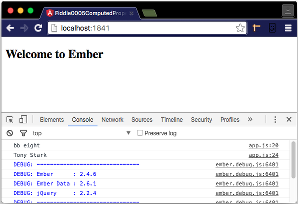

fiddle-0005-ComputedProperties
======

### Title

Ember Computed Properties

### Creation Date

06-22-16

### Location

Chicago, IL

### Issues

[Issue 38](https://github.com/bradyhouse/house/issues/38)

### Description

Simple POC exploring how to define and consume `computed properties` in ember.js. It is based on the fifth example outlined in
chapter 2 of Suchit Puri's book  __[Ember.js Web Development with Ember CLI](https://amzn.com/B00YEVZ6WI)__.

### Published Version Link

N/A

### Tags

ember, ember-cli, object, extend, property
