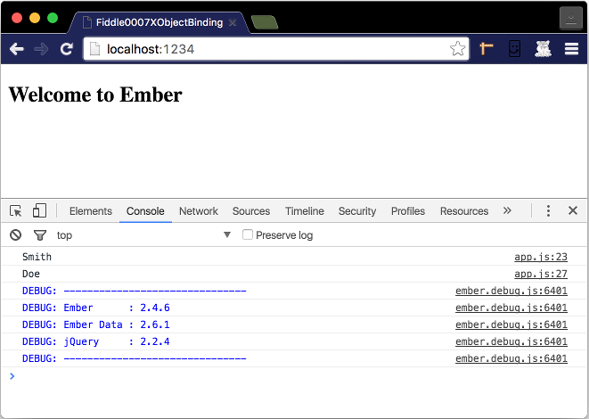

fiddle-0007-XObjectBinding
======

### Title

Cross Object Binding

### Creation Date

06-22-16

### Location

Chicago, IL

### Issues

[Issue 40](https://github.com/bradyhouse/house/issues/40)

### Description

POC exploring how to use a `compute alias` property to establish cross object binding.  It is based on the nineth 
example outlined in chapter 2 of Suchit Puri's book  __[Ember.js Web Development with Ember CLI](https://amzn.com/B00YEVZ6WI)__.

### Published Version Link

N/A

### Tags

ember, ember-cli
