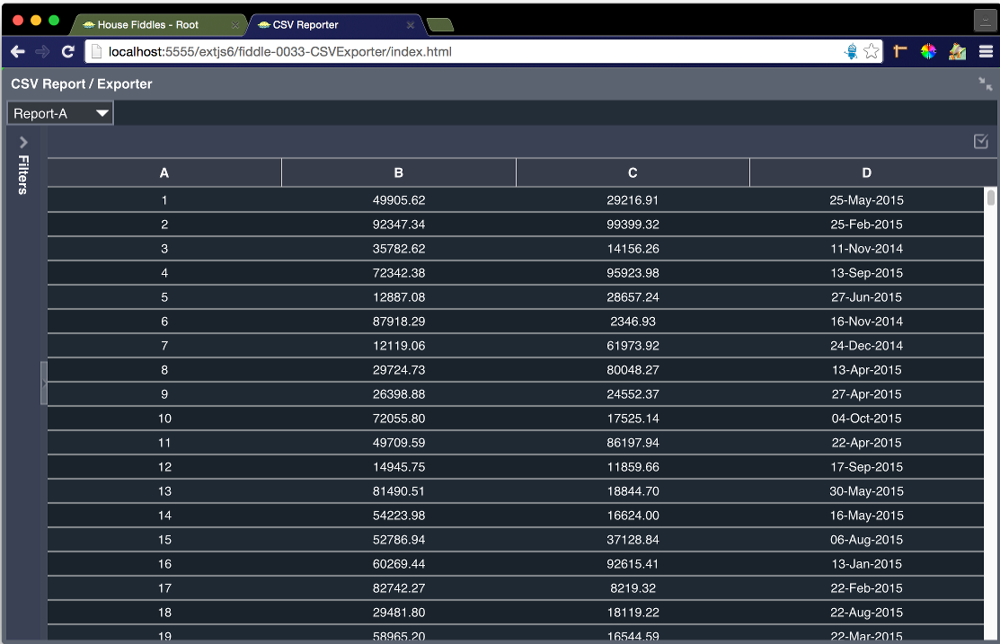

fiddle-0033-CSVExporter
======

### Title

CSV Reporter / Exporter

### Creation Date

02-05-16

### Description

Fiddle exploring how to bind an ExtJS grid to a CSV file.  Specifically, how to --

1. Using AJAX, download a CSV formatted text file
2. Transform the data using JQuery-CSV
3. Populate a store with the resulting JSON
4. Bind a grid panel to the store
5. Transform the contents of the store back to CSV
6. Create a physical download link recreating the original CSV file

### Published Version Link

[plnkr](http://embed.plnkr.co/VymxcsMRzcG3Xp6MuB5x/)

### Tags

ExtJS-6-1, JQuery-CSV, a, download

### Forked From

[fiddle-0030-CSVReporter](../fiddle-0030-CSVReporter)
