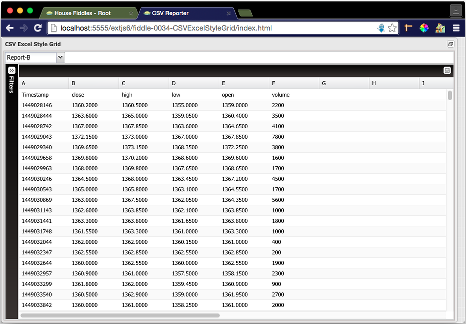

fiddle-0034-CSVExcelStyleGrid
======

### Title

CSV Excel Style Grid

### Creation Date

02-10-16

### Description

Fiddle exploring how to bind an ExtJS grid to a CSV file when the CSV file has an
irregular or non-tabular layout. There may be fields but they could occur
on the fifth line instead of first.  There could be 2 rows with extra values or
completely blank rows in the middle of the file.  Essentially,
the grid needs to be populated like Excel. It needs to be able to handle
any layout.

The functional use case is as follows:

    1. Using AJAX, download a CSV formatted text file
    2. Use a reducer to determine maximum number fields in the file
    3. Append a pseudo file header in the format "A ... Z, A1 ... Z1, An ... Zn"
    4. Transform the data using JQuery-CSV
    5. Populate a store with the resulting JSON
    6. Bind a grid panel to the store
    7. Transform the contents of the store back to CSV
    8. Create a physical download link recreating the original CSV file

### Published Version Link

[plnkr](http://embed.plnkr.co/Ju5uAITSOFon3hX8FmT1/)

### Tags

ExtJS-5-1, ExtJS-6-1, JQuery-CSV, a, download, reduce, map

### Forked From

[fiddle-0030-CSVReporter](../fiddle-0030-CSVReporter)

### Forked From

[fiddle-0033-CSVExporter](../fiddle-0033-CSVExporter)
