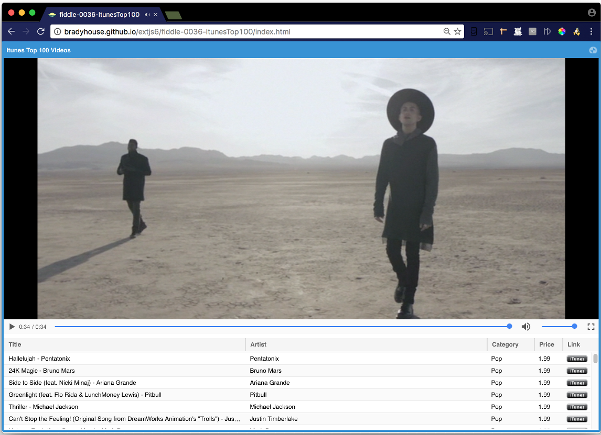

fiddle-0036-ItunesTop100
======

### Title

Itunes Top 100 Videos

### Creation Date

09-29-16

### Description

A _Refresher_ POC, lest I forget ExtJS.  In this case, the goal was to build a POC using ExtJS that provides an itunes 
inspired (like) interface and serves up the  [itunes top 100 videos rss feed](https://itunes.apple.com/us/rss/topsongs/limit=100/genre=20/explicit=true/xml).  
It should access the feed by making a POST request to the `passthru` endpoint on  [http://12-bradyhouse.rhcloud.com/](http://12-bradyhouse.rhcloud.com/).  See [Node Fiddle #19](https://github.com/bradyhouse/house/tree/master/fiddles/node/fiddle-0019-PassThruRest).  
_And then you (aka me) can build the same thing using `angular2`, `aurelia`, `ember` ..._ :(

### Issue

[Issue #74](https://github.com/bradyhouse/house/issues/74)

### Published Version Link

*   [Code Pen](http://codepen.io/bradyhouse/pen/xEmmoO/)
*   [bradyhouse.github.io > ExtJS 6 > fiddle #36](http://bradyhouse.github.io/extjs6/fiddle-0036-ItunesTop100/index.html)

### Tags

ExtJS-6-1, AJAX, Grid, Store, Video
