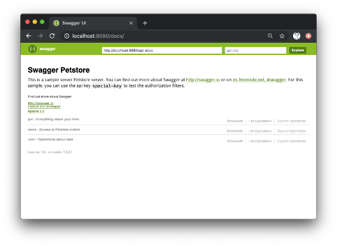

fiddle-0006-j2v8RestApi
======

### Title<a name="title"></a>

j2v8 hello world


### Creation Date<a name="creation-date"></a>

09-27-19


### Location<a name="location"></a>

Chicago, IL


### Issue<a name="issue"></a>

[318](https://github.com/bradyhouse/house/issues/318)


### Description<a name="description"></a>

Okay, so I can startup a node based web server inside the jvm using j2v8.  See [Java fiddle #5](https://github.com/bradyhouse/house/tree/master/fiddles/java/fiddle-0005-j2v8Hello). Now, what about a node based Rest API on one thread and interface interacts with it on another?  For the Rest API and UI samples, checkout [swagger-codegen](https://github.com/swagger-api/swagger-codegen).


### Pre-Requisites<a name="pre-req">

In order to run this fiddle, your mac should be configured with java 1.8+ and maven 3.3+.  To verify this configuration, from a command prompt run the following 
commands:

*   `java -version`
*   `mvn -version`

### Use Case<a name="use-case"></a>

1.  Open a command prompt and navigate to the project root directory
2.  Using maven install all dependencies -- `mvn install -Pdevelopment,mac`

        ```
        [INFO] Scanning for projects...
        [INFO]
        [INFO] ------------------------------------------------------------------------
        [INFO] Building fiddle 0.1.0
        [INFO] ------------------------------------------------------------------------
        [INFO]
        [INFO] --- frontend-maven-plugin:1.6:install-node-and-yarn (default) @ fiddle ---
        [INFO] Node v10.8.0 is already installed.
        [INFO] Yarn 1.3.2 is already installed.
        [INFO]
        [INFO] --- frontend-maven-plugin:1.6:yarn (yarn install) @ fiddle ---
        [INFO] Running 'yarn install' in /Users/bradyhouse/github/house_318/fiddles/java/fiddle-0006-j2v8RestApi/j2v8RestApi/src/main/nodejs
        [INFO] yarn install v1.3.2
        [ERROR] (node:69461) [DEP0005] DeprecationWarning: Buffer() is deprecated due to security and usability issues. Please use the Buffer.alloc(), Buffer.allocUnsafe(), or Buffer.from() methods instead.
        [INFO] [1/4] Resolving packages...
        [INFO] success Already up-to-date.
        [INFO] Done in 0.20s.
        [INFO]
        [INFO] --- maven-resources-plugin:2.6:resources (default-resources) @ fiddle ---
        [INFO] Using 'UTF-8' encoding to copy filtered resources.
        [INFO] Copying 2 resources
        [INFO] Copying 4467 resources to nodejs
        [INFO]
        [INFO] --- maven-compiler-plugin:3.1:compile (default-compile) @ fiddle ---
        [INFO] Changes detected - recompiling the module!
        [INFO] Compiling 3 source files to /Users/bradyhouse/github/house_318/fiddles/java/fiddle-0006-j2v8RestApi/j2v8RestApi/target/classes
        [INFO]
        [INFO] --- maven-resources-plugin:2.6:testResources (default-testResources) @ fiddle ---
        [INFO] Using 'UTF-8' encoding to copy filtered resources.
        [INFO] skip non existing resourceDirectory /Users/bradyhouse/github/house_318/fiddles/java/fiddle-0006-j2v8RestApi/j2v8RestApi/src/test/resources
        [INFO]
        [INFO] --- maven-compiler-plugin:3.1:testCompile (default-testCompile) @ fiddle ---
        [INFO] No sources to compile
        [INFO]
        [INFO] --- maven-surefire-plugin:2.12.4:test (default-test) @ fiddle ---
        [INFO] No tests to run.
        [INFO]
        [INFO] --- maven-jar-plugin:2.4:jar (default-jar) @ fiddle ---
        [INFO] Building jar: /Users/bradyhouse/github/house_318/fiddles/java/fiddle-0006-j2v8RestApi/j2v8RestApi/target/fiddle-0.1.0.jar
        [INFO]
        [INFO] --- spring-boot-maven-plugin:2.1.7.RELEASE:repackage (default) @ fiddle ---
        [INFO] Replacing main artifact with repackaged archive
        [INFO]
        [INFO] --- maven-install-plugin:2.4:install (default-install) @ fiddle ---
        [INFO] Installing /Users/bradyhouse/github/house_318/fiddles/java/fiddle-0006-j2v8RestApi/j2v8RestApi/target/fiddle-0.1.0.jar to /Users/bradyhouse/.m2/repository/fiddle/fiddle/0.1.0/fiddle-0.1.0.jar
        [INFO] Installing /Users/bradyhouse/github/house_318/fiddles/java/fiddle-0006-j2v8RestApi/j2v8RestApi/pom.xml to /Users/bradyhouse/.m2/repository/fiddle/fiddle/0.1.0/fiddle-0.1.0.pom
        [INFO]
        [INFO] --- maven-antrun-plugin:1.7:run (post-install-cleanup) @ fiddle ---
        [INFO] Skipping Antrun execution
        [INFO] ------------------------------------------------------------------------
        [INFO] BUILD SUCCESS
        [INFO] ------------------------------------------------------------------------
        [INFO] Total time: 20.453 s
        [INFO] Finished at: 2019-10-11T07:03:28-05:00
        [INFO] Final Memory: 52M/436M
        [INFO] ------------------------------------------------------------------------
        ```

3.  Navigate to the target directory
4.  Execute the resulting jar -- `java -jar fiddle-0.1.0.jar`
    
        ```
       {{ ʕ・ɭ・ʔ }}

        H o u s e
        oooooooooooo  o8o        .o8        .o8  oooo
        888       8  `"'        888        888   888
        888         oooo   .oooo888   .oooo888   888   .ooooo.
        888oooo8     888  d88   888  d88   888   888  d88   88b
        888          888  888   888  888   888   888  888ooo888
        888          888  888   888  888   888   888  888    .o
        o888o        o888o  Y8bod88P   Y8bod88P  o888o  Y8bod8P

        Java Fiddle #6


        [INFO ] 2019-10-11 06:55:07.787 [main] App - Starting App on bradyhouses-MacBook.local with PID 69210 (/Users/bradyhouse/github/house_318/fiddles/java/fiddle-0006-j2v8RestApi/j2v8RestApi/target/fiddle-0.1.0.jar started by bradyhouse in /Users/bradyhouse/github/house_318/fiddles/java/fiddle-0006-j2v8RestApi/j2v8RestApi/target)
        [INFO ] 2019-10-11 06:55:07.789 [main] App - No active profile set, falling back to default profiles: default
        [INFO ] 2019-10-11 06:55:07.893 [main] AnnotationConfigApplicationContext - Refreshing org.springframework.context.annotation.AnnotationConfigApplicationContext@61baa894: startup date [Fri Oct 11 06:55:07 CDT 2019]; root of context hierarchy
        [INFO ] 2019-10-11 06:55:09.853 [main] AnnotationMBeanExporter - Registering beans for JMX exposure on startup
        [INFO ] 2019-10-11 06:55:09.858 [main] EndpointMBeanExporter - Registering beans for JMX exposure on startup
        [INFO ] 2019-10-11 06:55:09.862 [main] DefaultLifecycleProcessor - Starting beans in phase 0
        [INFO ] 2019-10-11 06:55:09.865 [main] EndpointMBeanExporter - Located managed bean 'auditEventsEndpoint': registering with JMX server as MBean [org.springframework.boot:type=Endpoint,name=auditEventsEndpoint]
        [INFO ] 2019-10-11 06:55:09.888 [main] EndpointMBeanExporter - Located managed bean 'environmentEndpoint': registering with JMX server as MBean [org.springframework.boot:type=Endpoint,name=environmentEndpoint]
        [INFO ] 2019-10-11 06:55:09.910 [main] EndpointMBeanExporter - Located managed bean 'healthEndpoint': registering with JMX server as MBean [org.springframework.boot:type=Endpoint,name=healthEndpoint]
        [INFO ] 2019-10-11 06:55:09.923 [main] EndpointMBeanExporter - Located managed bean 'beansEndpoint': registering with JMX server as MBean [org.springframework.boot:type=Endpoint,name=beansEndpoint]
        [INFO ] 2019-10-11 06:55:09.928 [main] EndpointMBeanExporter - Located managed bean 'infoEndpoint': registering with JMX server as MBean [org.springframework.boot:type=Endpoint,name=infoEndpoint]
        [INFO ] 2019-10-11 06:55:09.936 [main] EndpointMBeanExporter - Located managed bean 'loggersEndpoint': registering with JMX server as MBean [org.springframework.boot:type=Endpoint,name=loggersEndpoint]
        [INFO ] 2019-10-11 06:55:09.964 [main] EndpointMBeanExporter - Located managed bean 'metricsEndpoint': registering with JMX server as MBean [org.springframework.boot:type=Endpoint,name=metricsEndpoint]
        [INFO ] 2019-10-11 06:55:09.973 [main] EndpointMBeanExporter - Located managed bean 'traceEndpoint': registering with JMX server as MBean [org.springframework.boot:type=Endpoint,name=traceEndpoint]
        [INFO ] 2019-10-11 06:55:09.978 [main] EndpointMBeanExporter - Located managed bean 'dumpEndpoint': registering with JMX server as MBean [org.springframework.boot:type=Endpoint,name=dumpEndpoint]
        [INFO ] 2019-10-11 06:55:10.003 [main] EndpointMBeanExporter - Located managed bean 'autoConfigurationReportEndpoint': registering with JMX server as MBean [org.springframework.boot:type=Endpoint,name=autoConfigurationReportEndpoint]
        [INFO ] 2019-10-11 06:55:10.010 [main] EndpointMBeanExporter - Located managed bean 'configurationPropertiesReportEndpoint': registering with JMX server as MBean [org.springframework.boot:type=Endpoint,name=configurationPropertiesReportEndpoint]
        [INFO ] 2019-10-11 06:55:10.076 [main] App - Application started with arguments:
        [INFO ] 2019-10-11 06:55:10.077 [main] Res - Building Resources @ /Users/bradyhouse/github/house_318/fiddles/java/fiddle-0006-j2v8RestApi/j2v8RestApi/target/nodejs
        [INFO ] 2019-10-11 06:55:12.675 [main] App - Started App in 5.31 seconds (JVM running for 6.741)
        Your server is listening on port 8080 (http://localhost:8080)
        Swagger-ui is available on http://localhost:8080/docs
        ```

5.  Open a web browser and navigate to "localhost:8080/docs"

    


### Tags<a name="tags"></a>

java, maven, maven-jar-plugin, j2v8, log4j2, commons-oi, springframework.boot, spring-boot-maven-plugin, com.github.eirslett


### Forked From

[fiddle-0006-j2v8RestApi](../fiddle-0005-j2v8Hello)
