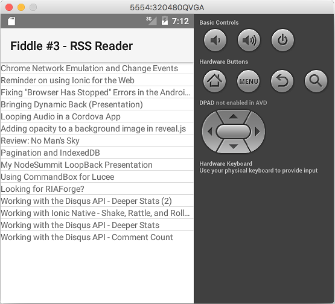

fiddle-0003-RssReader
======

### Title

rssreader

### Creation Date

09-21-16

### Location

Chicago, IL

### Issue

[Issue 68](https://github.com/bradyhouse/house/issues/68)

### Description

Digging around on the [NativeScript Resource Page](https://www.nativescript.org/resources) this morning I came across [Raymond Camden's RSS Reader Example](https://www.raymondcamden.com/2016/05/23/a-simple-rss-reader-in-nativescript/).  Smells like an interesting tangent to make more sense of chapter 2 of Nathanael Anderson's book,  [Getting Started with NativeScript](https://amzn.com/178588865X).  

### Tags

{N}, stacklayout, listview, 
