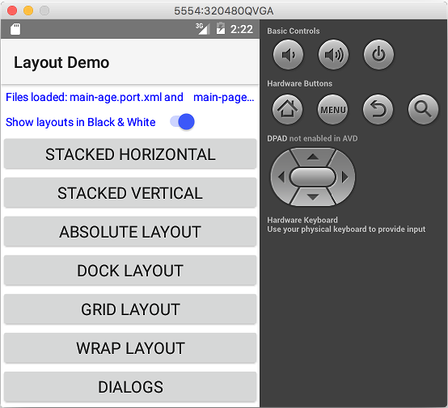

fiddle-0004-Layouts
======

### Title

layouts

### Creation Date

09-24-16

### Location

Chicago, IL

### Issue

[Issue 70](https://github.com/bradyhouse/house/issues/70)

### Description

Develop a POC based on the example discussed in chapter 4 of Nathanael Anderson's book,  [Getting Started with NativeScript](https://amzn.com/178588865X).  It explores the different layout options provided by NativeScript.

### Use Case

1.  Using your terminal app of choice navigate to the `scripts` directory
2.  Startup the POC `fiddle.sh start fiddle-0004-Layouts`

### Tags

{N}, nativescript, stack, wrap, absolute, grid, dock, dialog
