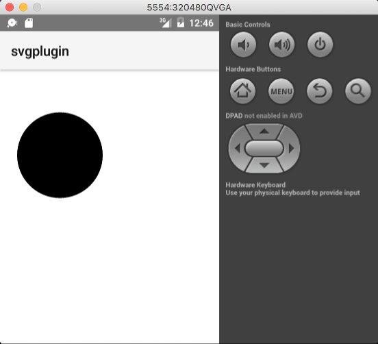

fiddle-0007-SvgPlugin
======

### Title

SVG Plugin

### Creation Date

09-30-16

### Location

Chicago, IL

### Issue

[Issue #79](https://github.com/bradyhouse/house/issues/79)

### Description

There is an [SVG Plugin for nativeScript](https://github.com/peoplewareDo/nativescript-svg).  This POC
explores how to use this plugin to load a simple circle svg.  Its _pretty, pretty_ limited.  Essentially
it seems to have sufficient functionality to load an SVG generated icon or logo.

### Use Case

1.  Using your terminal app of choice navigate to the `scripts` directory
2.  Startup the POC `fiddle.sh start fiddle-0007-SvgPlugin`

### Tags

{N}, nativescript, nativescript-svg
