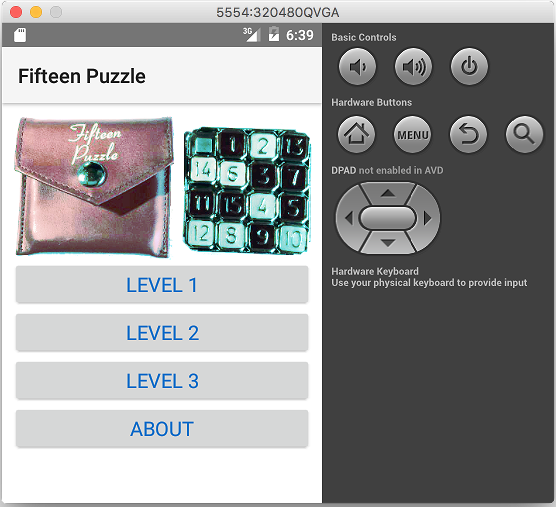

fiddle-0008-FifteenPuzzle
======

### Title

fifteenpuzzle

### Creation Date

10-04-16

### Location

Chicago, IL

### Issue

[Issue ??](https://github.com/bradyhouse/house/issues/??)

### Description

NativeScript fiddle template test.  This is a smoke test of the [fiddle.sh](../../scripts/fiddle.sh) script to verify that
it supports create/delete/refactor/list functionality for "nativescript" based POC's aka fiddles. This is only a test.

### Use Case

1.  Using your terminal app of choice navigate to the `scripts` directory
2.  Startup the POC `fiddle.sh start fiddle-0008-FifteenPuzzle`

### Tags

{N}, nativescript
