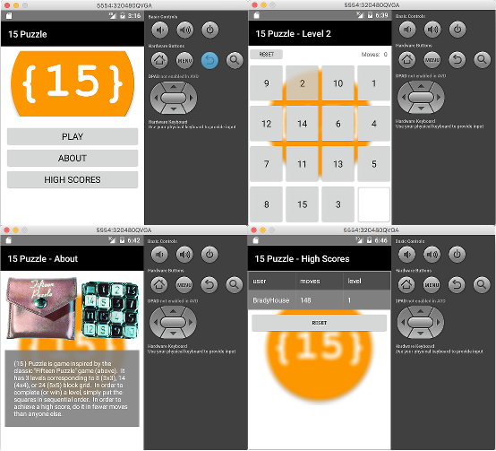

fiddle-0009-SqliteDb
======

### Title

{15} Puzzle

### Creation Date

10-04-16

### Location

Chicago, IL

### Issue

[Issue 84](https://github.com/bradyhouse/house/issues/84)

### Published Version Link

[Google Play](https://play.google.com/store/apps/details?id=org.nativescript.puzzle)

### Description

Explore how to integrate SqliteDb into a nativeScript app.   Use the [nativescript-sqlite](https://www.npmjs.com/package/nativescript-sqlite) lib.  As a starting point, extend  (fork) [NativeScript Fiddle #8](https://github.com/bradyhouse/house/tree/master/fiddles/nativeScript/fiddle-0008-FifteenPuzzle).  Enhance the game with a classic (old school arcade) high score feature that makes use of the database. When the user wins a given level, the game should: 

1.  Query the database for the existing highest score for that level
2.  If the user's score is higher, then prompt the user to record a high score
3.  After the user enter's their name (or 30 character string), write the value and their score to the database

Note - You may also want to explore using the database to persist game state.  However, this approach may be overkill (read/check the book).

### Use Case

1.  Using your terminal app of choice navigate to the `scripts` directory
2.  Startup the POC `fiddle.sh "start" "nativeScript" 0009`

### Tags

{N}, nativescript, nativescript-sqlite, nativescript-vibrator

### Forked From

[fiddle-0008-FifteenPuzzle](../fiddle-0008-FifteenPuzzle)
