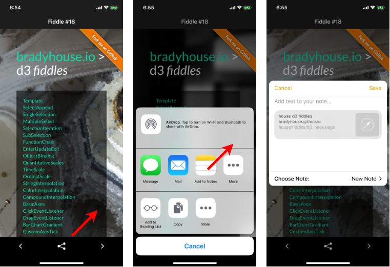

fiddle-0018-SocialShareMod
======

### Title

Social Share Button

### Creation Date

01-07-19

### Location

Chicago, IL

### Issue

[Issue 281](https://github.com/bradyhouse/house/issues/281)

### Description

[NativeScript fiddle 17](https://github.com/bradyhouse/house/tree/master/fiddles/nativeScript/fiddle-0017-BottomNavBar) addressed the bottom nav bar question.  Next problem:  `Social Media share button.`  
Given a web view based app, how do I allow users a way to send (or save) a link to the 
currently displayed page?  Of course there is a plug-in for that: [https://github.com/tjvantoll/nativescript-social-share](https://github.com/tjvantoll/nativescript-social-share). `Riddle me Fiddle`. 

### Pre-Requisite

*   A Mac loaded XCode and NativeScript
*   iOS Test Device or simulator

### Use Case

1.  On your test device install `NativeScript Playground` and `NativeScript Preview`
2.  Using your terminal app of choice, complete the [Bash Setup Procedure](https://github.com/bradyhouse/house/wiki/Setup-(Mac-OS))
3.  Startup the POC `fiddle start nativescript 0018`
4.  On your test device, launch `NativeScript Playground`
5.  Scan the QR Code visible in the terminal output (3)

### Forked From

[fiddle-0018-SocialShareMod](../fiddle-0017-BottomNavBar)

### Tags

{N}, nativescript, nativescript-bottombar, nativescript-social-share

