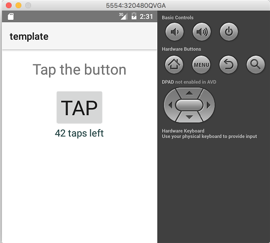

NativeScript (start)
======

Executing the command `./fiddle.sh "start" "nativescript" "fiddle-0000-Template` produces the following output.

    {{ ʕ・ɭ・ʔ }}
    FIDDLE.SH
    FIDDLE-START.SH
    ├────STARTSERVER
    ├────NVMINSTALL
    ├────ADBINSTALL
    ├────NVMUSENODEVER
    v5.1.0 is already installed.
    Now using node v5.1.0 (npm v3.3.12)
    ├────NATIVESCRIPTANDROIDSTART
    ├────STARTEMULATOR
    appending output to nohup.out
    ├────NATIVESCRIPTRUNANDROID
    Starting Android emulator with image 320480QVGA
    Waiting for emulator device initialization...
    Project successfully prepared (android)

    :config phase:  createDefaultIncludeFiles
      +found plugins: tns-core-modules-widgets

    :config phase:  createPluginsConfigFile
       Creating product flavors include.gradle file in /Users/bradyhouse/github/house/fiddles/nativeScript/fiddle-0000-Template/template/platforms/android/configurations folder...

    :config phase:  pluginExtend
      +applying configuration from: /Users/bradyhouse/github/house/fiddles/nativeScript/fiddle-0000-Template/template/platforms/android/configurations/include.gradle
      +applying configuration from: /Users/bradyhouse/github/house/fiddles/nativeScript/fiddle-0000-Template/template/platforms/android/configurations/tns-core-modules-widgets/include.gradle

    :config phase:  copyAarDependencies

    :config phase:  addAarDependencies
      +adding dependency: /Users/bradyhouse/github/house/fiddles/nativeScript/fiddle-0000-Template/template/platforms/android/libs/aar/widgets-release.aar
    Observed package id '..;..;..;var;lib;android-sdk;samples;android-19' in inconsistent location '/usr/local/Cellar/android-sdk/24.1.2/samples/android-19' (Expected '/usr/local/Cellar/android-sdk/24.1.2/../../../var/lib/android-sdk/samples/android-19')
    Observed package id '..;..;..;var;lib;android-sdk;samples;android-23' in inconsistent location '/usr/local/Cellar/android-sdk/24.1.2/samples/android-23' (Expected '/usr/local/Cellar/android-sdk/24.1.2/../../../var/lib/android-sdk/samples/android-23')
    Incremental java compilation is an incubating feature.
    :preBuild UP-TO-DATE
    :preF0DebugBuild UP-TO-DATE
    :checkF0DebugManifest
    :preF0ReleaseBuild UP-TO-DATE
    :prepareComAndroidSupportAnimatedVectorDrawable2421Library UP-TO-DATE
    :prepareComAndroidSupportAppcompatV72421Library UP-TO-DATE
    :prepareComAndroidSupportSupportCompat2421Library UP-TO-DATE
    :prepareComAndroidSupportSupportCoreUi2421Library UP-TO-DATE
    :prepareComAndroidSupportSupportCoreUtils2421Library UP-TO-DATE
    :prepareComAndroidSupportSupportFragment2421Library UP-TO-DATE
    :prepareComAndroidSupportSupportMediaCompat2421Library UP-TO-DATE
    :prepareComAndroidSupportSupportV42421Library UP-TO-DATE
    :prepareComAndroidSupportSupportVectorDrawable2421Library UP-TO-DATE
    :prepareTemplateRuntimeUnspecifiedLibrary UP-TO-DATE
    :prepareWidgetsReleaseLibrary UP-TO-DATE
    :prepareF0DebugDependencies
    :compileF0DebugAidl UP-TO-DATE
    :compileF0DebugRenderscript UP-TO-DATE
    :generateF0DebugBuildConfig UP-TO-DATE
    :cleanLocalAarFiles
    :ensureMetadataOutDir
    :collectAllJars
    :setProperties
    :asbg:generateInterfaceNamesList
    :asbg:runAstParser UP-TO-DATE
    :asbg:generateBindings UP-TO-DATE
    :mergeF0DebugShaders UP-TO-DATE
    :compileF0DebugShaders UP-TO-DATE
    :generateF0DebugAssets UP-TO-DATE
    :mergeF0DebugAssets
    :generateF0DebugResValues UP-TO-DATE
    :generateF0DebugResources UP-TO-DATE
    :mergeF0DebugResources UP-TO-DATE
    :processF0DebugManifest UP-TO-DATE
    :processF0DebugResources
    :generateF0DebugSources
    :incrementalF0DebugJavaCompilationSafeguard UP-TO-DATE
    :compileF0DebugJavaWithJavac UP-TO-DATE
    :compileF0DebugNdk UP-TO-DATE
    :compileF0DebugSources UP-TO-DATE
    :buildMetadata UP-TO-DATE
    :prePackageMarkerForF0Debug
    :transformClassesWithDexForF0Debug
    Merged dex #1 (205 defs/310.9KiB)
    Merged dex #2 (5 defs/15.1KiB)
    Merged dex #3 (348 defs/566.3KiB)
    Merged dex #4 (434 defs/465.5KiB)
    Merged dex #5 (130 defs/242.7KiB)
    Merged dex #6 (53 defs/75.9KiB)
    Merged dex #7 (56 defs/147.0KiB)
    Merged dex #8 (141 defs/172.0KiB)
    Merged dex #9 (1 defs/0.7KiB)
    Merged dex #10 (15 defs/47.5KiB)
    Merged dex #11 (51 defs/123.5KiB)
    Merged dex #12 (51 defs/84.9KiB)
    Merged dex #13 (73 defs/58.2KiB)
    Merged dex #14 (10 defs/15.2KiB)
    Merged dex #15 (8 defs/8.3KiB)
    Merged dex #16 (17 defs/28.5KiB)
    Merged dex #17 (249 defs/186.4KiB)
    Merged dex #18 (46 defs/7.4KiB)
    Merged dex #19 (58 defs/88.1KiB)
    Result is 1951 defs/3189.4KiB. Took 0.3s
    :myMergeDex
    Result compacted from 4059.8KiB to 2401.4KiB to save 1658.4KiB
    Merged dex #1 (1 defs/1.6KiB)
    Merged dex #2 (1 defs/1.4KiB)
    Merged dex #3 (1 defs/1.9KiB)
    Merged dex #4 (1 defs/1.7KiB)
    Merged dex #5 (1 defs/1.4KiB)
    Merged dex #6 (1 defs/1.6KiB)
    Merged dex #7 (1 defs/1.4KiB)
    Merged dex #8 (1 defs/1.3KiB)
    Merged dex #9 (1 defs/1.5KiB)
    Merged dex #10 (1 defs/1.7KiB)
    Merged dex #11 (1 defs/1.3KiB)
    Merged dex #12 (1 defs/2.7KiB)
    Merged dex #13 (1 defs/1.5KiB)
    Merged dex #14 (1 defs/1.4KiB)
    Merged dex #15 (1 defs/1.6KiB)
    Merged dex #16 (1 defs/1.6KiB)
    Merged dex #17 (1 defs/1.7KiB)
    Merged dex #18 (1 defs/1.3KiB)
    Merged dex #19 (1 defs/1.4KiB)
    Merged dex #20 (1 defs/1.7KiB)
    Merged dex #21 (1 defs/1.8KiB)
    Merged dex #22 (1 defs/1.7KiB)
    Merged dex #23 (1 defs/1.4KiB)
    Merged dex #24 (1 defs/1.3KiB)
    Merged dex #25 (1 defs/1.4KiB)
    Merged dex #26 (1 defs/1.4KiB)
    Merged dex #27 (1 defs/2.0KiB)
    Merged dex #28 (1 defs/1.3KiB)
    Merged dex #29 (1 defs/2.3KiB)
    Merged dex #30 (1 defs/1.5KiB)
    Merged dex #31 (1 defs/2.1KiB)
    Merged dex #32 (1 defs/1.4KiB)
    Merged dex #33 (1 defs/1.5KiB)
    Merged dex #34 (1 defs/1.3KiB)
    Merged dex #35 (1 defs/1.4KiB)
    Merged dex #36 (1 defs/1.3KiB)
    Merged dex #37 (1 defs/1.4KiB)
    Merged dex #38 (1 defs/1.7KiB)
    Merged dex #39 (1 defs/1.6KiB)
    Merged dex #40 (1 defs/1.3KiB)
    Merged dex #41 (1 defs/1.3KiB)
    Merged dex #42 (1 defs/1.5KiB)
    Merged dex #43 (1 defs/1.4KiB)
    Merged dex #44 (1 defs/2.5KiB)
    Merged dex #45 (1 defs/2.6KiB)
    Merged dex #46 (1 defs/1.2KiB)
    Merged dex #47 (1 defs/1.3KiB)
    Merged dex #48 (1951 defs/3189.4KiB)
    Result is 1998 defs/2401.4KiB. Took 0.2s
    :mergeF0DebugJniLibFolders UP-TO-DATE
    :transformNative_libsWithMergeJniLibsForF0Debug UP-TO-DATE
    :processF0DebugJavaRes UP-TO-DATE
    :transformResourcesWithMergeJavaResForF0Debug UP-TO-DATE
    :validateDebugSigning
    :packageF0Debug
    :zipalignF0Debug
    :assembleF0Debug
    :assembleDebug
    :buildapk

    BUILD SUCCESSFUL

    Total time: 15.882 secs

    This build could be faster, please consider using the Gradle Daemon: https://docs.gradle.org/2.10/userguide/gradle_daemon.html
    Project successfully built
    Successfully deployed on device with identifier 'emulator-5554'.

Once the process completes, the template fiddle should startup on the configured emulator:

