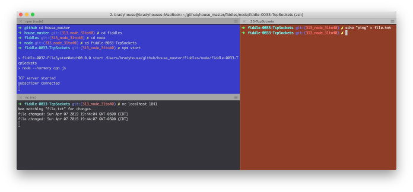

fiddle-0033-TcpSocket
======

### Title

TCP Socket

### Author 

bradyhouse@gmail.com

### Creation Date

04-06-19

### Location

Chicago, IL

### Issue

[Issue 301](https://github.com/bradyhouse/house/issues/301)

### Description

How do you create TCP Socket Server and establish a connection? `Riddle me Fiddle`.

### Use Case

1.  Open a console enter the command `npm start`
2.  Using a second console, enter the command `nc localhost 1841`
2.  Using a third console, enter the command `echo "ping" >> file.txt`
3.  This should produce the following output in the second console (lower left)

    

### Tags

node.js, hamony, process, argv, fs, child_process, spawn, net, createServer, listen

### Forked From

[fiddle-0032-FileSystemWatch](../fiddle-0032-FileSystemWatch)
