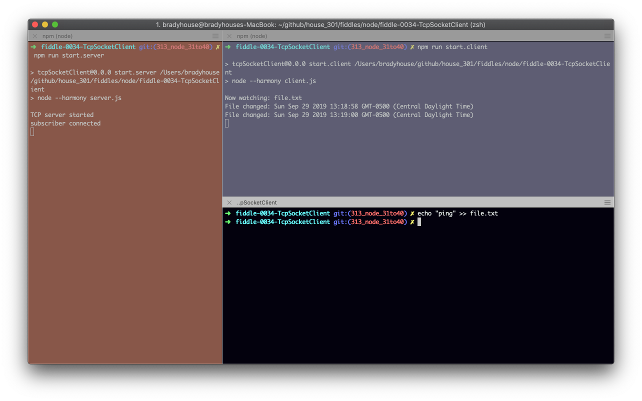

fiddle-0033-TcpSocket
======

### Title

TCP JSON Protocol

### Author 

bradyhouse@gmail.com

### Creation Date

09-29-2019

### Location

Chicago, IL

### Issue

[Issue 301](https://github.com/bradyhouse/house/issues/301)

### Description

Given you have created TCP Socket Server how do you programmatically create a connection? In
other words, how to create a socket client connection app? 

__Note, this fiddle adapted from the example given in Chapter 3 of Jim Wilson's book, [Node.js 8 the Right Way](http://www.pragmaticprogrammer.com/titles/jwnode2).__

### Use Case

1.  Open a console and navigate to the fiddle's root directory
2.  Enter the command `npm start.server`
3.  Open a second console and navigate to the fiddle's root directory
4.  Enter the command `npm start.client`
5.  Open a third console and navigate to the fiddle's root directory
6.  Enter the command `echo "ping" >> file.txt`
7.  This should produce the following output in the second console (upper right)

    

### Tags

node.js, hamony, process, argv, fs, child_process, spawn, net, createServer, listen

### Forked From

[fiddle-0033-TcpSockets](../fiddle-0033-TcpSockets)
