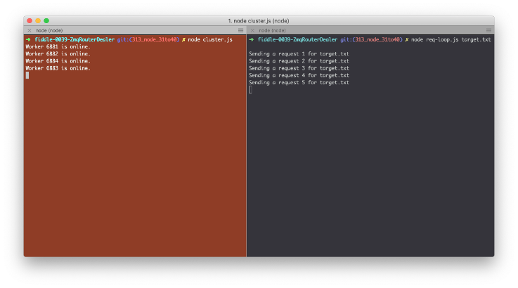

fiddle-0039-ZmqRouterDealer
======

### Title 

Zero MQ Router/Dealer

### Author 

bradyhouse@gmail.com

### Creation Date 

10-13-19

### Location 

Chicago, IL

### Issue 

[Issue 313](https://github.com/bradyhouse/house/issues/313)

### Description 

What are the building blocks of a node networking `MicroService` module?  [Fiddle #38](../fiddle-0037-ZmqReqRep) demonstrates how to implement a simple req/rep design pattern using [0MQ](https://www.npmjs.com/package/zeromq).  Another important pattern to know when building a node based networking `MicroService` is the `Router & Dealer` pattern. This fiddle demonstrates how this can be implemented using [0MQ](https://www.npmjs.com/package/zeromq).

__Note, this fiddle adapted from the example given in Chapter 4 of Jim Wilson's book, [Node.js 8 the Right Way](http://www.pragmaticprogrammer.com/titles/jwnode2).__

### Use Case

1.  Open a console and navigate to the fiddle's root directory
2.  Enter the command `npm install`
3.  Enter the command `node cluster.js`
4.  Open a second console and navigate to the fiddle's root directory
5.  Enter the command `node req-loop.js`

### Tags 

node.js, hamony, process, argv, fs, zeromq
