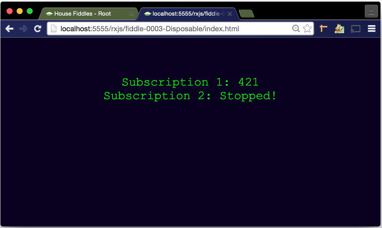

fiddle-0003-Disposable
======

### Title

RxJS - Disposable

### Creation Date

04-04-16

### Location

Chicago, IL

### Description

Fiddle exploring how to create a simple interval observable, with 2 subscriptions.  After 5 seconds, the
second subscription is disposed of.

### Published Version Link

[jsfiddle.net](https://jsfiddle.net/bradyhouse/61kc9qfk/)

### Tags

rx: observable: create, inverval, subscribe, dispose;
d3: select, text;
