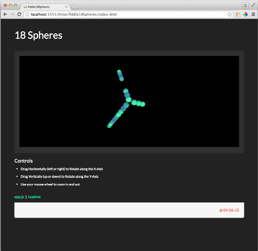

fiddle-0003-18Spheres
======

### Title

18 Spheres

### Creation Date

04-08-2015

### Location

Chicago, IL US

### Description

Fiddle exploring --

1. How to add a variable (n) number of sphere meshes to a scene
2. Add each sphere to the scene so that its in a unique location
3. Use a variable color for each sphere
4. During the frame request loop, change the position of each sphere

NOTE - the maximum value of "n" turned out to be 18. After 18 WebGL stops working.

### Published Version Link

[js fiddle](http://jsfiddle.net/bradyhouse/vxjk7kg5/)
[code pen](http://codepen.io/bradyhouse/pen/VLXwEZ)

### Tags

three.js, r61, SphereGeometry, OrbitAndPanControls, TrackballControls

### Forked From

[fiddleFlyingSpheres](../fiddleFlyingSpheres/README.markdown)

