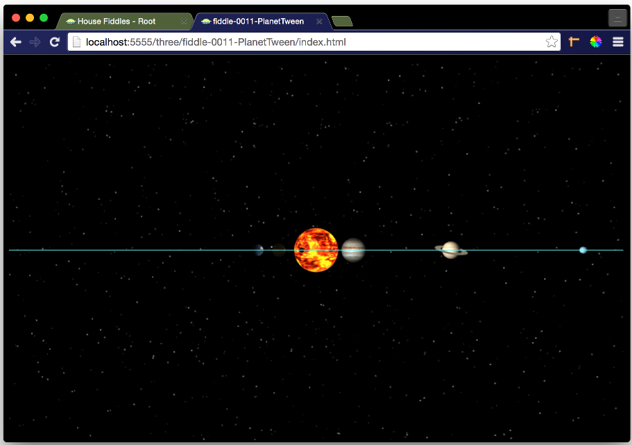

fiddle-0011-PlanetTween
======

### Title

Planet Tween

### Creation Date

01/18/2016

### Location

Chicago

### Description

Pen exploring how to apply tween effects in 3D space. It takes the "Tweening" concepts discussed in Chapter 4 of Tony Parisi's book, **WebGL Up and Running**, and applies them to the examples presented in Chapter 3.

### Published Version Link

[codepen.io](http://codepen.io/bradyhouse/pen/JGOWRo)

### Tags

three.js, r46, es6, renderer, object3d, clock, repeat, spheregeometry, shadermaterial, fragmentshader, vertexshader

### Forked From

[fiddle-0005-EarthMoon](../fiddle-0005-EarthMoon)

### Forked From

[fiddle-0006-Saturn](../fiddle-0006-Saturn)

### Forked From

[fiddle-0007-Stars](../fiddle-0007-Stars)

### Forked From

[fiddle-0008-Orbit](../fiddle-0008-Orbit)

### Forked From

[fiddle-0009-Sun](../fiddle-0009-Sun)

### Forked From

[fiddle-0010-SolarSystem](../fiddle-0010-SolarSystem)
