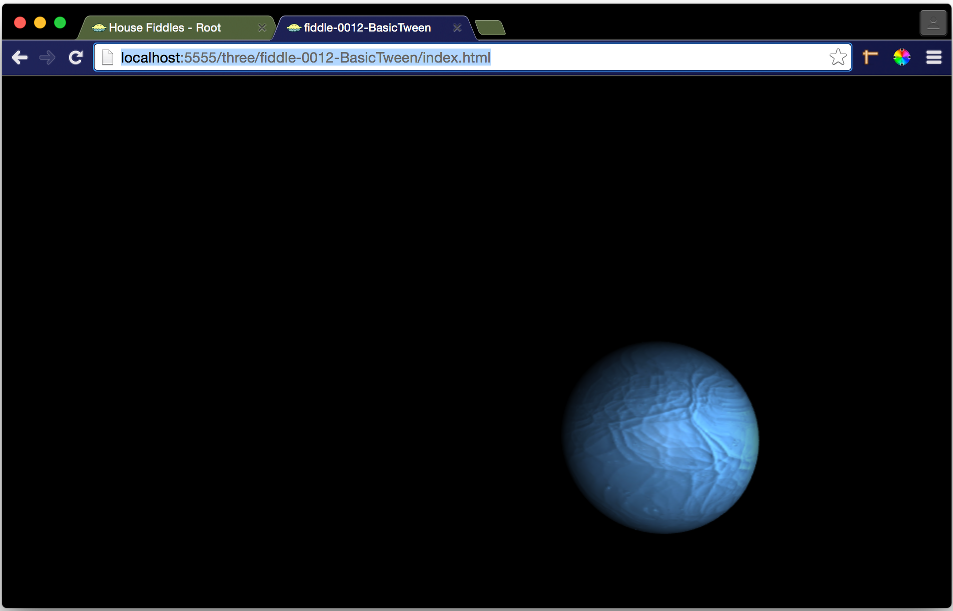

fiddle-0012-BasicTween
======

### Title

Basic Tween

### Creation Date

01/18/2016

### Location

Chicago, IL US

### Description

Pen exploring the basic tweening examples in chapter 4 of Tony Parisi's book, **WebGL Up and Running**.

### Published Version Link

[codepen.io](http://codepen.io/bradyhouse/pen/xZPdLL)

### Tags

three.js, tween.js, r46, es6
