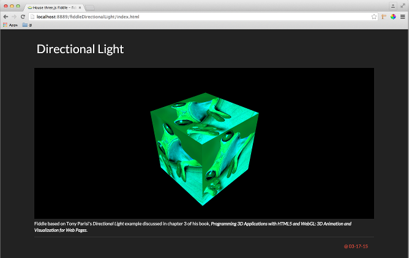

fiddleDirectionalLight
======

### Title

Directional Light

### Creation Date

03-17-15

### Location

Banff, Alberta Canada

### Description

Fiddle based on Tony Parisi's Directional Light example discussed in chapter 3 of his book,
**Programming 3D Applications with HTML5 and WebGL: 3D Animation and Visualization for Web Pages**.

### Published Version Link

N/A

### Tags

three.js, Parisi, CubeGeometry, MeshPhongMaterial, DirectionalLight
