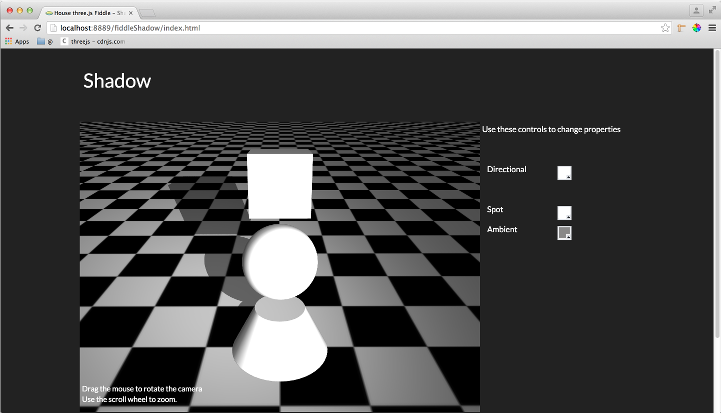

fiddleShadow
======

### Title

Shadow

### Creation Date

03-22-2015

### Location

Chicago, IL US

### Description

Fiddle based on Tony Parisi's Shadow example discussed in chapter 4 of his book,
**Programming 3D Applications with HTML5 and WebGL: 3D Animation and Visualization for Web Pages**.

### Published Version Link

N/A

### Tags

three.js, PerspectiveCamera, DirectionalLight, SpotLight, AmbientLight, PCFSoftShadowMap, Object3D, PlaneGeometry
